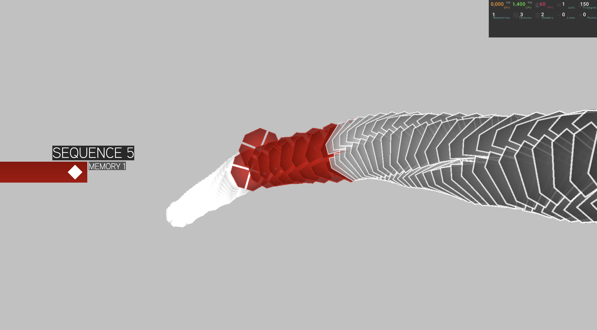

# 🧬 Assassin's Creed 2 DNA Menu (Instanced Shader Render)
## 📸 Screenshots



This project is a real-time 3D recreation of the **classic Assassin's Creed II DNA menu**, powered by **Three.js**, **React Three Fiber (r3f)**, and **@three.ez/instanced-mesh**.  
It uses a **shader-based instanced mesh renderer** to deliver high-performance visuals with efficient GPU-driven rendering.

Navigate through sequences and cells just like Desmond did — in your browser.

---

## 🚀 Demo

> [Try it here](https://ac-2-dna-ui.vercel.app/)
> [also available here](https://stackblitz.com/~/github.com/Lunakepio/ac-2-dna-ui)

---

## 🧰 Tech Stack

- [three.js](https://threejs.org/)
- [@react-three/fiber (r3f)](https://github.com/pmndrs/react-three-fiber)
- [@three.ez/instanced-mesh](https://www.npmjs.com/package/@three.ez/instanced-mesh)
- GLSL Shader Materials

---

## 🎮 Controls

| Key        | Action                          |
|------------|----------------------------------|
| `← / A`     | Navigate Left (Sequence/Cell)   |
| `→ / D`     | Navigate Right (Sequence/Cell)  |
| `Enter`    | Select Sequence / Enter Cell View |
| `Escape`    | Unselect Sequence / Unselect Cell View |

---

## 🛠️ Getting Started

### 1. Clone the Repository

```bash
git clone https://github.com/your-username/ac2-dna-menu-clone.git
cd ac2-dna-menu-clone

```

### 2. Install Dependencies

```bash
npm install || bun install
```

### 3. Run the Project

```bash
npm run dev || bun run dev
```

## ✨ Features
- Fully GPU-accelerated with InstancedMesh2

- Custom shaders replicating the glowing DNA strands

- Keyboard-based navigation

- Modular, component-driven architecture

- Accurate layout inspired by Assassin’s Creed II’s iconic UI
